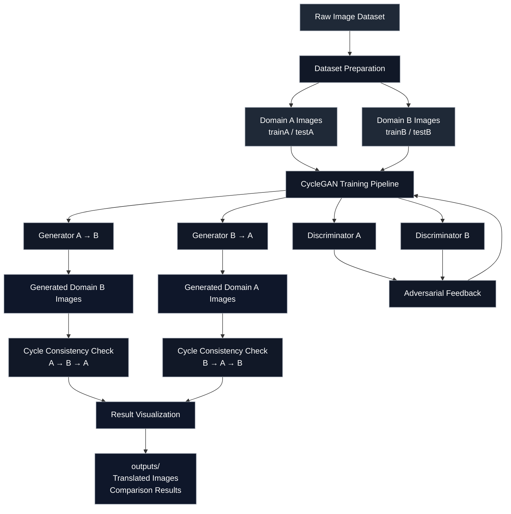
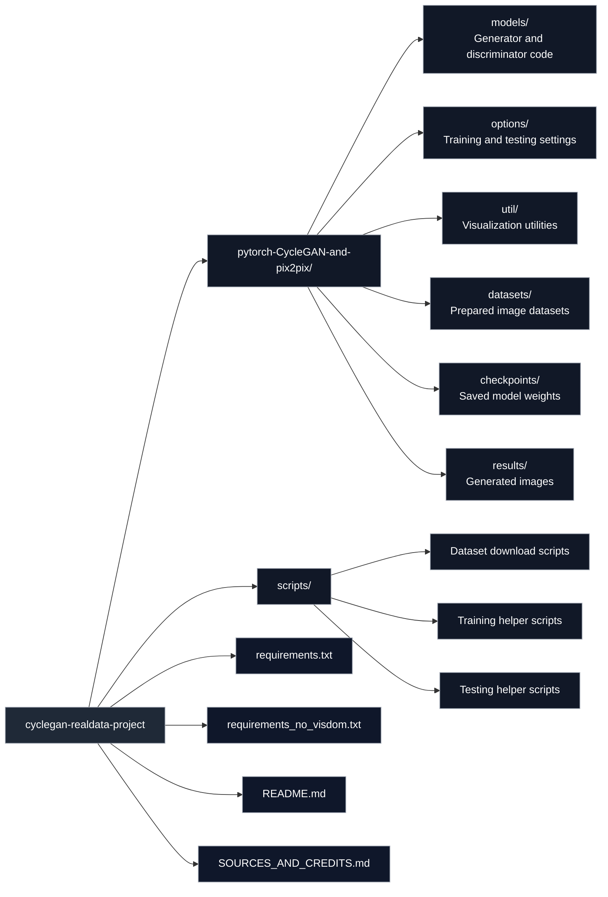

# CycleGAN Real Data Project

A PyTorch-based CycleGAN project for unpaired image-to-image translation. The project learns visual transformations between two image domains without requiring matched image pairs.

The goal is to understand how generative adversarial networks can transfer the style or appearance of one visual domain to another while preserving the main structure of the input image.

---

## Problem Solved

Collecting paired image datasets is often difficult in real-world computer vision tasks. In many cases, we may have two separate groups of images, but no exact before-and-after pairs.

For example, we may have images from Domain A and images from Domain B, but not the same object or scene captured in both domains.

CycleGAN solves this problem by learning from unpaired datasets. It learns the relationship between two visual domains and generates translated images without needing one-to-one image correspondence.

This project demonstrates how unpaired image translation can be used to:

* Learn mappings between two image domains
* Transfer visual style from one domain to another
* Preserve important content from the original image
* Generate translated outputs without paired supervision

---

## Technical Overview

CycleGAN uses two generator networks and two discriminator networks.

### Generator Networks

The generators learn the image translation mappings:

```text
Domain A → Domain B
Domain B → Domain A
```

* **Generator A→B** translates images from Domain A into the style of Domain B
* **Generator B→A** translates images from Domain B into the style of Domain A

### Discriminator Networks

The discriminators evaluate whether images look real or generated:

* **Discriminator A** checks whether an image looks like a real Domain A image
* **Discriminator B** checks whether an image looks like a real Domain B image

The generator tries to produce realistic translated images, while the discriminator tries to distinguish real images from generated ones.

---

## Training Losses

CycleGAN is trained using a combination of losses.

| Loss                   | Purpose                                                       |
| ---------------------- | ------------------------------------------------------------- |
| Adversarial loss       | Makes generated images look realistic                         |
| Cycle consistency loss | Ensures translating A→B→A reconstructs the original image     |
| Identity loss          | Helps preserve color, structure, and domain-specific features |

The key idea is cycle consistency. If an image is translated from Domain A to Domain B and then back to Domain A, the reconstructed image should be close to the original.

```text
A → B → A ≈ A
B → A → B ≈ B
```

This allows the model to learn meaningful transformations without paired training data.

---

## Project Structure



---

## Repository Layout



---

## Folder Layout

```text
cyclegan-realdata-project/
│
├── pytorch-CycleGAN-and-pix2pix/
│   ├── models/
│   ├── options/
│   ├── util/
│   ├── datasets/
│   ├── checkpoints/
│   └── results/
│
├── scripts/
│   ├── check_dataset.py
│   ├── download_dataset.py
│   ├── train_cyclegan.py
│   └── test_cyclegan.py
│
├── requirements.txt
├── requirements_no_visdom.txt
├── SOURCES_AND_CREDITS.md
└── README.md
```

---

## Dataset Structure

Each CycleGAN dataset follows this format:

```text
datasets/
└── dataset_name/
    ├── trainA/
    ├── trainB/
    ├── testA/
    └── testB/
```

Where:

| Folder   | Description                   |
| -------- | ----------------------------- |
| `trainA` | Training images from Domain A |
| `trainB` | Training images from Domain B |
| `testA`  | Test images from Domain A     |
| `testB`  | Test images from Domain B     |

The model learns the translation between Domain A and Domain B using these unpaired image sets.

---

## Setup

Create a virtual environment:

```bash
python -m venv .venv
```

Activate the environment.

For Windows:

```bash
.venv\Scripts\activate
```

For Mac or Linux:

```bash
source .venv/bin/activate
```

Install the required packages:

```bash
pip install -r requirements.txt
```

---

## Usage

### Dataset Preparation

Download or prepare a CycleGAN dataset:

```bash
python scripts/download_dataset.py horse2zebra
```

Check whether the dataset folders are correctly arranged:

```bash
python scripts/check_dataset.py
```

---

### Training

Train a CycleGAN model:

```bash
python train.py --dataroot ./datasets/dataset_name --name experiment_name --model cycle_gan
```

---

### Testing

Test a trained or pretrained model:

```bash
python test.py --dataroot ./datasets/dataset_name/testA --name experiment_name --model test --no_dropout
```

Generated results are saved inside the `results/` folder.

---

## Outputs

| Output                   | Description                                             |
| ------------------------ | ------------------------------------------------------- |
| Translated images        | Images converted from one domain to another             |
| Input-output comparisons | Visual comparison between original and generated images |
| Checkpoints              | Saved generator and discriminator weights               |
| Training logs            | Model training progress and loss values                 |
| Result folders           | Generated images saved after testing                    |

---

## Technical Stack

* Python
* PyTorch
* CycleGAN
* Generative Adversarial Networks
* Computer Vision
* Image-to-Image Translation
* Deep Learning

---

## Learning Objective

This project was built to understand how CycleGAN performs unpaired image-to-image translation using real image datasets.

The project focuses on:

* Understanding generator and discriminator training
* Preparing datasets for unpaired image translation
* Running CycleGAN training and testing workflows
* Visualizing generated image outputs
* Studying cycle consistency in GAN-based models
* Exploring how deep learning models transfer image style between domains

---

## Summary

This project demonstrates a complete CycleGAN workflow for unpaired image-to-image translation. It shows how two image domains can be mapped to each other without paired examples by combining adversarial learning, cycle consistency, and identity preservation.

The final output is a practical computer vision pipeline that can generate translated images and help understand how generative models learn visual domain transformations.
